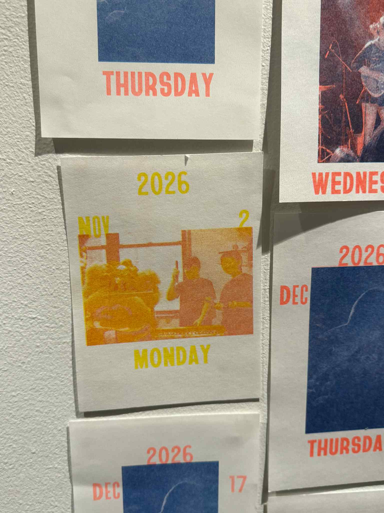
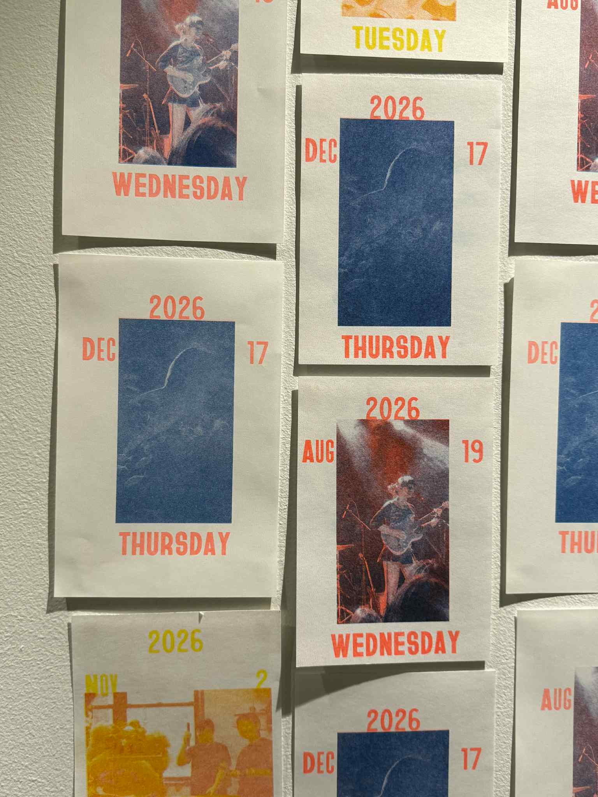
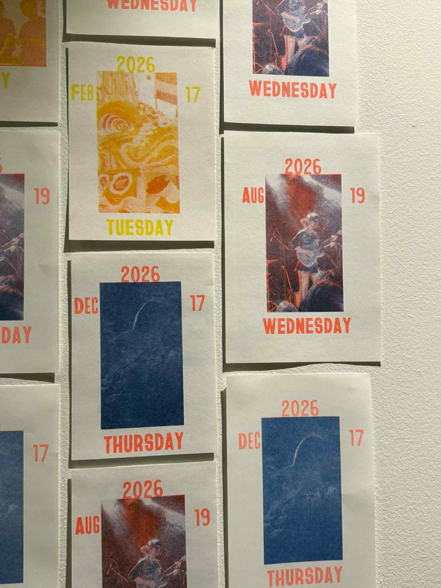
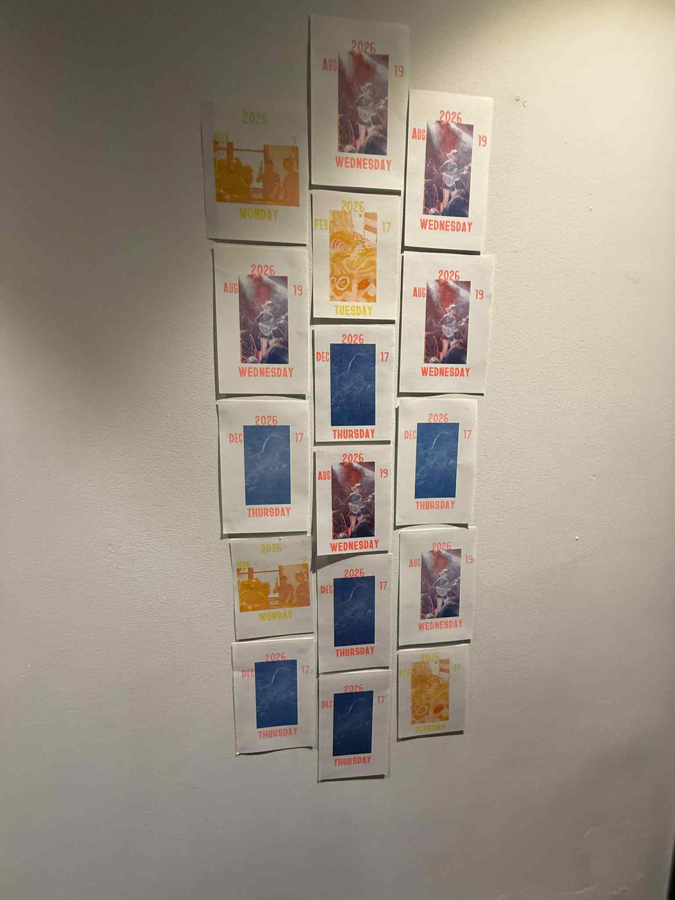
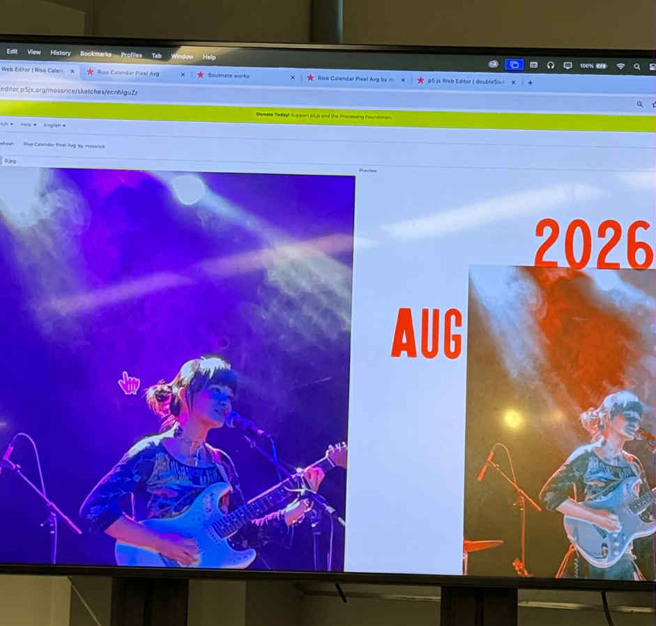

Project is hosted at: https://editor.p5js.org/mossrice/sketches/ecnhlguZr

This is a Riso Calendar Generator! This will look at the photo's metadata and retrieve the date. Each calendar page will list the day of the week at the bottom, the upcoming year on top, with the month and date below that. The photo will be situated in the middle.
The user can press S to save the file, which will also separate the file into 2 colors for layered risograph printing, simplifying the process without relying on photoshop or other tools.

